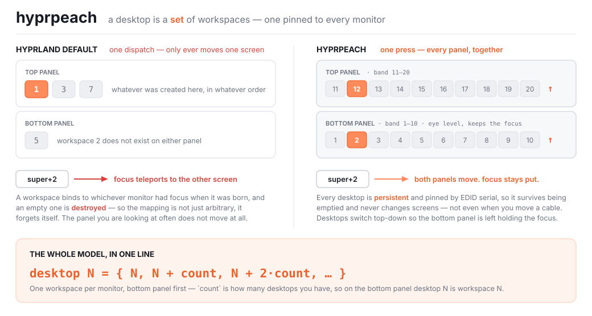
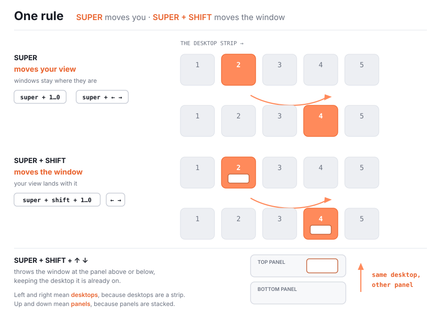

<div align="center">

# 🍑 hyprpeach

**An opinionated way for monitors and workspaces to interact.**

*Your monitors are one desk, not two computers. Press a key, the whole desk turns.*

<br>

[](https://hypr.land)
[](#install)
[](#the-bar-strip)
[](#install)
[](LICENSE)

<br>

[**How it works**](#how-it-works) · [**Just install it**](#yeah-yeah-whatever--gimme-the-install-command-for-omarchy) · [**The keymap**](#the-keymap) · [**Install**](#install) · [**Upgrading**](#upgrading) · [**The bar strip**](#the-bar-strip) · [**API**](#api) · [**Prior art**](#prior-art)

</div>

<br>

## How it works

<div align="center">

</div>

Hyprland cannot show one workspace on two monitors at once — asked directly, its maintainer's answer was [*"you can't do that"*](https://github.com/hyprwm/Hyprland/discussions/10088).

So stop trying. **A desktop is a _set_ of workspaces**, one pinned to each monitor, and every desktop action dispatches once per monitor. Press `super+3` and both panels turn together, always.

<br>

## Yeah yeah whatever — gimme the install command for omarchy

```bash
curl -fsSL https://raw.githubusercontent.com/mariotinoco/hyprpeach/v1.1.1/install.sh | bash
```

It reads your monitors out of `hyprctl`, writes the `setup()` call with them already filled in — bottom panel first, matched by EDID serial — clones the release, installs [the bar strip](#on-omarchy-one-more-line), puts `hyprpeach` on your `PATH`, and reloads. Run it twice and nothing doubles up: the block it writes is fenced by markers and replaced, not appended, which is also how [upgrading](#upgrading) works.

<details>
<summary>Piping a stranger's script into bash, you say</summary>

<br>

Fair. Read it first, then run it:

```bash
curl -fsSL https://raw.githubusercontent.com/mariotinoco/hyprpeach/v1.1.1/install.sh -o hyprpeach-install.sh
less hyprpeach-install.sh && bash hyprpeach-install.sh
```

Or skip it entirely — [Install](#install) is the library by hand, and it is not long. It leaves out what only the script does: the bar strip, the two displaced widgets, and the `hyprpeach` command. `HYPRPEACH_TAG=v1.1.1` picks a different release.

</details>

<br>

## The keymap

<div align="center">

</div>

Nothing else to learn. `SUPER + ↑ ↓` is left alone, so directional window focus survives on the axis the panels are stacked on. Your view follows a window you fling.

<br>

## Install

Works on **any Hyprland ≥ 0.55** — plain Arch, Omarchy, NixOS, whatever runs the compositor. Hyprland 0.55 is where Lua became a first-class config language, which is all this needs: no compiler, no `hyprpm`, no daemon, nothing to install beside it.

```bash
git clone --branch v1.1.1 https://github.com/mariotinoco/hyprpeach ~/.config/hypr/hyprpeach
```

**Clone a tag, not a branch.** A release cannot change under you, and upgrading stays a decision you make rather than one that happens the next time you pull. Leave `--branch` off to track `main` and take what comes; upgrade later with `git fetch --tags && git checkout v1.1.1`.

Then in your Hyprland Lua config, **after** whatever binds your number row:

```lua
-- Hyprland's Lua path looks for `name.lua`, not `name/init.lua`, so a cloned
-- directory needs this line before it can be required.
package.path = os.getenv("HOME") .. "/.config/hypr/?/init.lua;" .. package.path

require("hyprpeach").setup({
  -- The only required option: your monitors in PHYSICAL order, bottom first.
  -- The first one takes the un-offset band, so on it desktop N is workspace N.
  -- These serials are made up; `hyprctl monitors all` prints yours. Two of one
  -- model is the case worth showing, because then the serial is the only thing
  -- telling them apart.
  monitors_bottom_to_top = {
    "desc:Samsung Electric Company Odyssey G95NC HNTX000001",  -- bottom
    "desc:Samsung Electric Company Odyssey G95NC HNTW000002",  -- top
  },

  -- Everything below is a default. Delete any line to keep it.
  desktop_count               = 10,    -- and so how wide each monitor's band is
  focus_follows_fling         = true,  -- your view lands with a window you fling
  notify                      = true,  -- a toast for actions with no on-screen result
  unbind_conflicting_defaults = true,  -- clear stock bindings that move one panel

  -- Merged chord by chord, so overriding one keeps the rest. An unknown name
  -- is refused rather than ignored, and `false` frees a key outright: nothing
  -- is bound, the stock binding is still cleared, and the matching `peach.*`
  -- function stays callable.
  keys = {
    focus_desktop_modifier          = "SUPER",
    send_window_modifier            = "SUPER + SHIFT",
    previous_desktop_arrow          = "SUPER + LEFT",
    next_desktop_arrow              = "SUPER + RIGHT",
    send_window_to_previous_desktop = "SUPER + SHIFT + LEFT",
    send_window_to_next_desktop     = "SUPER + SHIFT + RIGHT",
    send_window_to_panel_above      = "SUPER + SHIFT + UP",
    send_window_to_panel_below      = "SUPER + SHIFT + DOWN",

    send_window_and_follow_modifier = false,  -- always follows, whatever the flag says
    next_desktop                    = false,
    previous_desktop                = false,
    former_desktop                  = false,
    next_desktop_scroll             = false,
    previous_desktop_scroll         = false,
    swap_panels                     = false,
    gather_rogue_windows            = false,
  },
})
```

> [!IMPORTANT]
> Order matters. `setup` clears the stock single-dispatch bindings before installing its own, and an unbind cannot remove a binding that does not exist yet. On Omarchy that means after `require("default.hypr.omarchy")`.

> [!TIP]
> **Use `desc:` selectors with the serial, not `DP-3`.** Connector names change when cables move ports, and on two monitors of the same model your desktops would silently swap screens with nothing reporting it. `hyprctl monitors all` prints the full description — the trailing token is the serial.

### On Omarchy, one more line

Omarchy users also get [the bar strip](#the-bar-strip):

```bash
omarchy plugin add https://github.com/mariotinoco/hyprpeach --enable
omarchy plugin disable omarchy.workspaces
omarchy plugin disable omarchy.menu
```

Same repository, and Omarchy's plugin manager keeps its own copy of it. The strip is an extra, not a requirement.

Both widgets are displaced rather than merely unused. `omarchy.workspaces` [cannot draw a hyprpeach desk](#the-bar-strip) at all. `omarchy.menu` is the widget ahead of the strip in the left section, and the strip is built to lead it — it reaches out to line its first tile up with the edge of a tiled window, which is only the right place to be when nothing sits in front of it. The menu is still one keypress away on `SUPER`, and `omarchy plugin enable omarchy.menu --section left` puts it back.

<br>

---

<br>

## Upgrading

```bash
hyprpeach upgrade
```

It moves the clone to the newest release and re-runs *that release's* `install.sh`, so upgrading and installing are one path rather than two that drift apart. `hyprpeach version` says what is installed and what is available. Both are safe to run when you are already current.

The command is laid down by `install.sh`, so you have it if you used the one-liner. A hand install upgrades by hand, the same way it installed:

```bash
git -C ~/.config/hypr/hyprpeach fetch --tags --force origin
git -C ~/.config/hypr/hyprpeach checkout v1.1.1
```

`--force` is not optional there: without it a tag that ever moved upstream fails the whole fetch with *would clobber existing tag*, and the upgrade stops before it starts.

<br>

## What you get

|  | Stock Hyprland | 🍑 hyprpeach |
|---|---|---|
| `super+N` | Teleports focus to whichever monitor owns workspace N | Every panel moves to **its own** desktop N |
| Where a workspace lives | Whichever monitor had focus when it was born | Pinned to one monitor, by **EDID serial** |
| An emptied workspace | **Destroyed** — and forgets its monitor | Persists. Always there, always the same screen |
| `super+←` `→` | Focuses a window one place over | Steps the whole desk one desktop, both panels, wrapping |
| Sending a window to another screen | No binding — `moveworkspacetomonitor` moves the *whole workspace* | One window crosses; both desktops stay intact |
| Unplugging a monitor | Its windows are stranded where no key can reach them | `gather_rogue_windows` sweeps them back |
| Flinging a window away | No single-key way to cross screens at all | One key per direction, and your view lands with it |
| A pinned window | Flips a monitor up or down, seemingly at random, as you change desktop | Stays on the panel you pinned it to |

<br>

### Why a pinned window used to wander

Hyprland re-records a pinned window's workspace every time that window takes focus, as whatever the *focused* monitor is showing — true on a one-monitor desk, and wrong on every other, because the monitor holding the focus need not be the monitor the window is pinned to. It writes the field and nothing else, so the window does not move and the mismatch is invisible.

A paired switch focuses every panel in turn, so it walks straight into it: the panel that switches first takes the focus, and a pinned window on *another* panel is picked up by the refocus that follows. The window is now recorded on a workspace belonging to a monitor it is not on — and the next time *that* panel changes desktop, Hyprland carries the window along with the workspace it is recorded on, dragging it physically onto the wrong screen. Which way it goes depends on which panel focused it last, which is why it looks random.

hyprpeach puts every pinned window back on the workspace its own monitor is showing before each panel switch, so a pinned window is carried by its own panel — and again afterwards, so anything reading the compositor between switches reads the truth.

<br>

## Bindings

**hyprpeach adds four chords** — `SUPER + SHIFT + arrows`. Everything else on the keymap is a chord your compositor already binds, taken over so it means the same thing on every panel; a workspace binding hyprpeach *ignores* is a binding that splits your desk.

### What this displaces

Stock Omarchy bindings, given up on purpose: on a two-panel desk the desktop strip is travelled far more often than a window is nudged one place left.

| Chord | Was | Now |
|---|---|---|
| `SUPER + ←` `→` | Focus left / right window | Previous / next desktop |
| `SUPER + SHIFT + ←` `→` | Swap window left / right | Fling window one desktop along |
| `SUPER + SHIFT + ↑` `↓` | Swap window up / down | Fling window to the panel above / below |

**`SUPER + ↑` `↓` is left alone**, so directional window focus survives on the axis where the panels are stacked.

### Off by default

`SUPER + TAB`, `SUPER + SHIFT + TAB`, `SUPER + CTRL + TAB`, `SUPER + scroll` and `SUPER + SHIFT + ALT + 1…0` are bound to nothing — the table above already covers the day. Name a chord for any of them in [`keys`](#install) to bring it back.

> [!IMPORTANT]
> Their **stock** bindings are cleared regardless, and so is the whole ten-key number row even when you have fewer desktops. A chord hyprpeach declines to bind is not a chord that falls silent — it is the stock one, still live, still moving a single panel.

<br>

## API

Everything is callable from your own config, and from `hyprctl eval` — which matters, because a paired switch is *two* dispatches and `hyprctl dispatch` is a wrapper for exactly one.

```lua
local peach = require("hyprpeach")
```

| Function | |
|---|---|
| `peach.focus_desktop({ desktop })` | Bring every panel to that desktop |
| `peach.current_desktop()` | The desktop in front of you, or `nil` on a special workspace |
| `peach.step_desktop({ step })` | Step by ±N, wrapping at both ends |
| `peach.focus_former_desktop()` | Back to the previous desktop |
| `peach.focus_window_with_its_desktop({ window })` | **For status bars.** Focus a window *and* bring every panel to the desktop it lives on |
| `peach.send_active_window_to_desktop({ desktop, follow })` | Move a window between desktops, keeping its panel |
| `peach.send_active_window_to_relative_desktop({ step, follow })` | Fling it ±N desktops along, wrapping, from the window's own desktop |
| `peach.send_active_window_to_panel({ step, follow })` | Move a window between panels, keeping its desktop |
| `peach.swap_panels()` | Swap what the two panels show |
| `peach.gather_rogue_windows()` | Rescue windows stranded outside every band |
| `peach.describe()` | One line of live state, and whether the panels agree |

### Wiring up a status bar

A bar's window list almost certainly dispatches `focus({ window })`, which follows the window onto *its* monitor and says nothing about the others — splitting your panels apart. Point it here instead:

```bash
hyprctl eval 'require("hyprpeach").focus_window_with_its_desktop({ window = "address:0x5f3a21" })'
```

### Catching a split

The panels disagreeing is the one state this model cannot show you: each bar draws its own panel's workspace, so nothing on screen says they have drifted apart. `describe()` is how you find out.

```console
$ hyprctl eval 'return require("hyprpeach").describe()'
panel 1 → desktop 5, panel 2 → desktop 5  [paired]
```

<br>

## The bar strip

*Omarchy only. Everything above works without it.*

Omarchy's own `omarchy.workspaces` widget cannot draw a hyprpeach desk. It filters to `id > 0 && id <= 10`, so a second monitor's band is invisible to it — every bar on every screen draws the *first* monitor's workspaces. And clicking one dispatches a single focus, splitting the pair the moment you touch the mouse.

The replacement lives in `omarchy/` and is installed with [the one extra line](#on-omarchy-one-more-line) above.

### On a desk with no window gaps

Every measure in the strip is derived from Hyprland's `general:gaps_out`, because the point is to line the tiles up with the windows. Set it to `0` and there is no gutter left to line up with, so the strip falls back to the shell's own smallest spacing for the things you can see — the inset, the gap between tiles, the clearance from the screen edge — and stops reaching past the bar's own padding to meet a window edge that is not there. A desk that does use gaps is unaffected.

<br>

### The strip

Three states that differ in **shape**, not only in brightness — so you can rank them from peripheral vision, across a very wide panel, without reading them:

| | Looks like | Means |
|---|---|---|
| **Current** | bar-coloured numeral on a near-solid tile | the desktop you are on |
| **Occupied** | bright numeral on a faint tile | has windows on it |
| **Empty** | faint numeral, no tile | nothing there |

All three are **the same ink at three alphas**, and the ink is plain white or plain black — whichever contrasts with the bar — rather than a colour out of the theme.

A themed accent was tried first and does not survive contact with real themes. `Color.bar.active` is an arbitrary hue: on one theme a clean pink, on the next a muddy red on cream, and on a third so close to the bar background that the three states collapse into one. Neutral ink cannot clash, because it is defined *against the surface it sits on* — the widget measures the bar's Rec. 709 luminance and picks the side that contrasts.

The marks are **rounded tiles, not circles**. A circle has to clear its own diagonal, so it wastes the corners of every cell and pushes the strip longer than it needs to be; a tile fills the cell and packs tighter.

<details>
<summary><b>How the strip is positioned</b></summary>

<br>

The bar is transparent, so there is no painted bar to be centred inside — its width has no edges an eye can see. What *is* visible is the **gutter**: the bar plus the gap Hyprland leaves between it and the nearest window. The strip is inset by exactly one window gap from both sides of that gutter, which is what "centred" means here. Measuring against the bar instead left the tiles 5px from the screen edge and 15px from the window, which read as shoved against the edge.

The first tile starts where a tiled window's **content** starts — the window gap, plus the border drawn inside it. A window's frame begins at the gap, but the border sits on top of that and is thin and usually a different colour, so the inner edge is the one an eye reads as "the top of the window". Aligning to the frame measures correct and looks wrong by exactly the border width. Since the bar pads its own ends further in than that, the strip reaches back out past that padding — the leading margin is often negative.

Tiles are one window gap apart, the same measure as everything else here.

These come from `Style.gapsOut`, the shell's own reading of Hyprland's `general:gaps_out`, re-read when the compositor changes — **it stores half the compositor's value**, so the real gap is twice it — plus `general:border_size`, which the shell does not read, so the widget reads it once at startup itself.

Every term is an integer of logical pixels — `Style.gapsOut * 2`, `Style.space(8)`, `barSize` — so the sums are exact at any font base size rather than accumulating a rounding error per step.

> [!NOTE]
> The tiles keep a proportional corner radius rather than `Style.cornerRadius`. That token mirrors `decoration:rounding`, which is `0` on plenty of setups — matching it would make the tiles square.

Desktop 10 is drawn as **`0`**, because that is the key you press for it — and it keeps every numeral one character wide, so it sits inside a circle instead of straining against one.

<br>

</details>

<details>
<summary><b>How the overlay works</b></summary>

<br>

When the desktop changes, a large numeral flashes in the middle of the screen and fades out. It is there to be glanced at, not read — with a desk this wide it is easy to lose track of where you are, and a number you catch out of the corner of your eye is faster than finding the bar.

It appears on **every screen at once**, because on a paired desk every panel just moved — whichever monitor you happen to be looking at has the number on it. It watches the **compositor**, not a keybinding, so it fires however the desktop changed — keyboard, a click in the bar, a script. hyprpeach knows nothing about it.

The numeral is translucent, with an outline in the theme's background colour kept firmer than the fill — so you see straight through it and it still reads over a light wallpaper, a dark one, or a busy one.

The alpha is on the numeral rather than on the window: fading the whole item would ghost the outline along with the fill and lose exactly the contrast the outline exists to provide.

> [!NOTE]
> A paired switch is one dispatch *per panel*, so the focused workspace changes once per monitor for a single keypress. The overlay compares **desktops**, not workspace IDs, which is what keeps it to one flash per press instead of one per screen.

The surface is visual only — its layer-shell input region is empty, so it never eats a click even while it is on screen.

It appears with no fade at all. On something this brief a ramp reads as lag: by the time a fade and a spring had settled, most of the hold was already spent. Only the exit is animated. The surface is sized to the numeral rather than to the screen, and the glyph is cached as a texture rather than re-drawn from outlines, so there is as little as possible between the keypress and the pixels.

<br>


> [!IMPORTANT]
> The bar widget hot-reloads on save. **The overlay does not** — it is a `keepLoaded` panel, so the shell holds its instance and a stale QML cache survives even `omarchy-shell shell rescanPlugins`. After editing it, run `omarchy restart shell`.

> [!NOTE]
> Omarchy "plugins" are Quickshell **bar** plugins, a different extension point from Hyprland's Lua config. The library half is installed with `git clone`; only the `omarchy/` half is an `omarchy plugin`. One repository, because they are one idea and they share a version.

<br>

</details>

## Nothing to compile

Hyprland 0.55 made Lua a first-class config language, and everything the library needs — workspace rules, keybindings, dispatchers, live window and monitor queries — is reachable from it. So there is no `hyprpm` plugin here: native code linked against a compositor's internals breaks on **every** release until someone rebuilds it, and this is a file you `git clone` once. hyprsplit and split-monitor-workspaces both reached the same conclusion and moved to Lua; this started there.

> [!NOTE]
> The optional bar strip *is* an "Omarchy plugin", which is a different thing entirely — a [Quickshell](https://quickshell.org) QML widget for Omarchy's status bar, not compiled code inside the compositor. It is QML that hot-reloads, and nothing about it changes the paragraph above. Skip it and hyprpeach works exactly the same.

<br>

## Prior art

This library owes a great deal to work done in the open, and the debts are specific.

### [hyprsplit](https://github.com/shezdy/hyprsplit) — *shezdy*

The direct ancestor, and the better starting point if you want the other model.

- **`persistent_workspaces`** — the single most important line in this library. Without persistence Hyprland destroys an emptied workspace and the monitor it was pinned to is forgotten with it, so the mapping is not merely arbitrary, it is *amnesiac*. hyprsplit named this and made it an option; `hyprpeach` makes it unconditional, because there is no version of this model that works without it.
- **`grab_rogue_windows`** — named a failure mode that is easy to not think about until it costs you: unplug a monitor and its windows sit on workspaces no keybinding can reach. Reimplemented here as `gather_rogue_windows`.
- **`monitor_priority`** — the idea of reserving a deterministic band of workspace IDs per monitor. `hyprpeach` keys those bands to EDID serials rather than names, which is a *difference*, not an improvement in judgement: hyprsplit's choice is the right one when your monitors are distinguishable.
- **`swap_monitors`** — hyprsplit shipped this as a dispatcher first. It is native to Hyprland now, and `peach.swap_panels()` is a thin wrapper that knows which two monitors you meant.

### [split-monitor-workspaces](https://github.com/zjeffer/split-monitor-workspaces) — *zjeffer, originally Duckonaut*

The original awesome/dwm-like workspaces for Hyprland, and the project that established per-monitor workspace bands as a thing Hyprland users want. It also pioneered detecting a tiling plugin at runtime and deferring to its dispatchers — a good idea `hyprpeach` does not yet implement.

### [pyprland](https://github.com/hyprland-community/pyprland)

Its `shift_monitors` plugin rotates workspaces across every screen in one command — the first place I saw the insight that a multi-monitor action should be *one* user-level gesture that fans out, rather than N gestures the user has to sequence.

### [Hyprland](https://github.com/hyprwm/Hyprland) — *vaxerski and contributors*

For the Lua config API this is built on, and for a straight answer about what the compositor will not do, which is worth more than a workaround.

> **The difference in one sentence:** hyprsplit and split-monitor-workspaces give each monitor its **own independent** set of workspaces, where `super+N` moves only the screen you are looking at. `hyprpeach` binds the monitors **together** into one desk that turns as a unit. Both are correct; they are answers to different questions about what a second monitor is *for*. If you want independent screens, use hyprsplit — it is mature, well-tested and does that job properly.

<br>

## License

[MIT](LICENSE).
